# Teakwondo_player_detection

### Player detection

Performance comparison

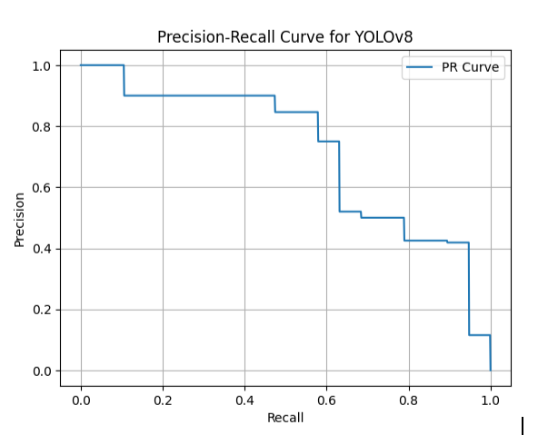
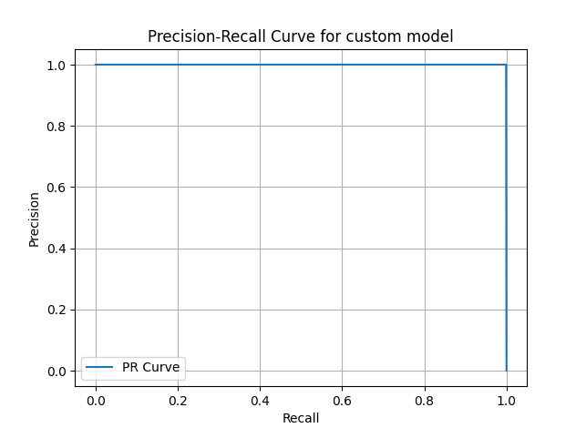
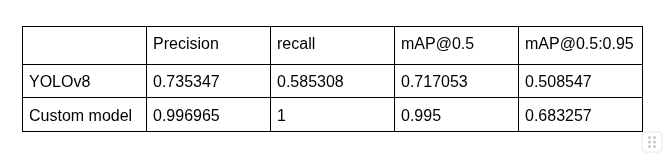

Output for the test images from YOLOv8 model

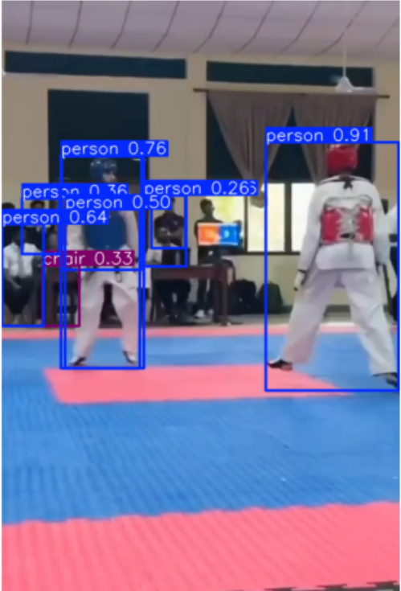
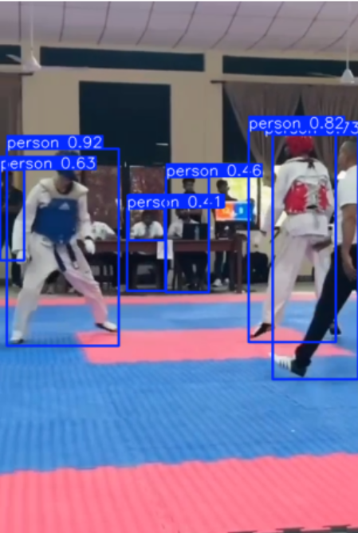
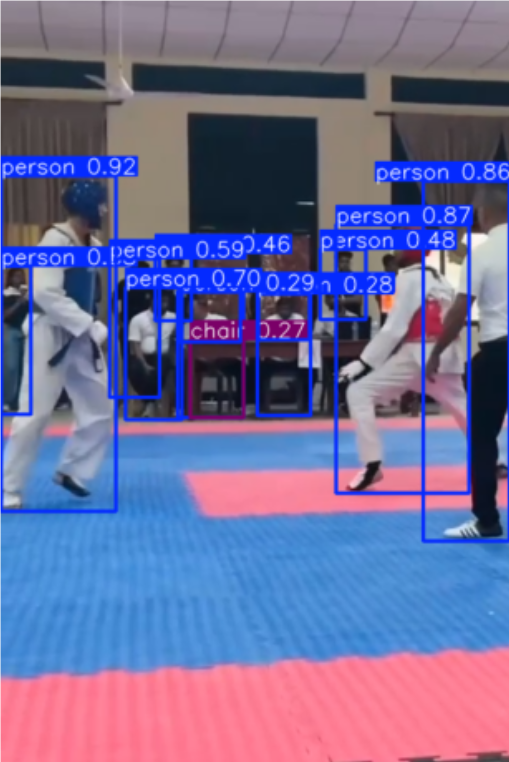
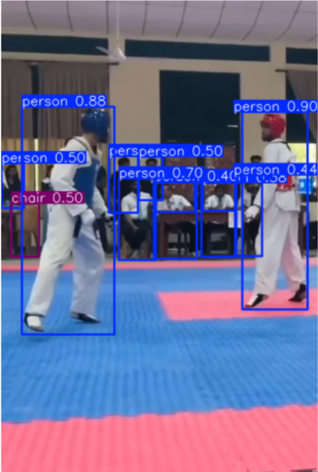
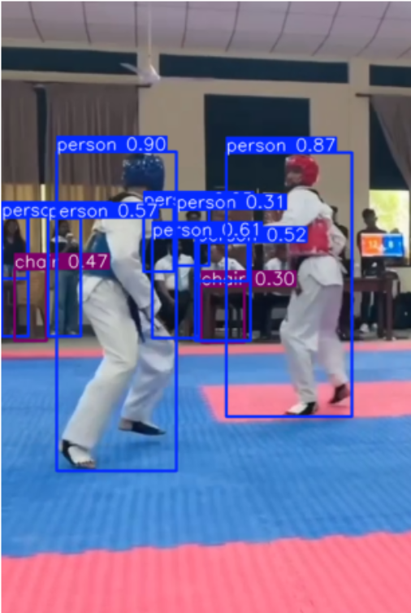
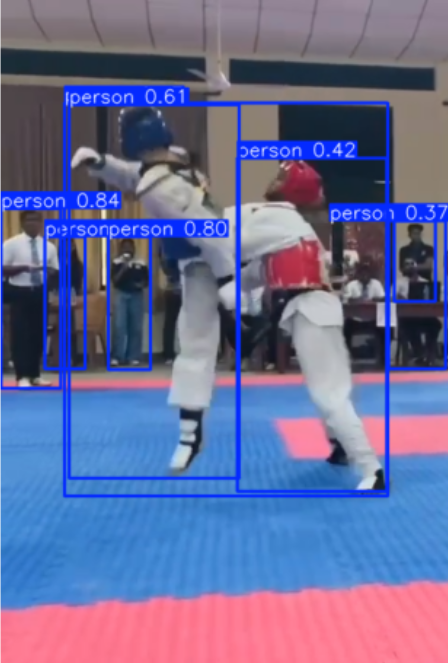
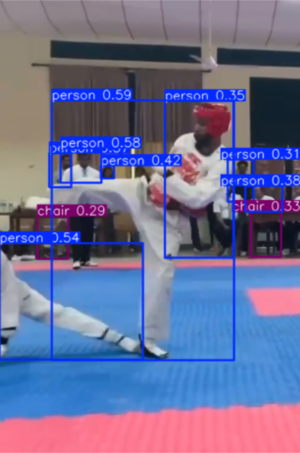
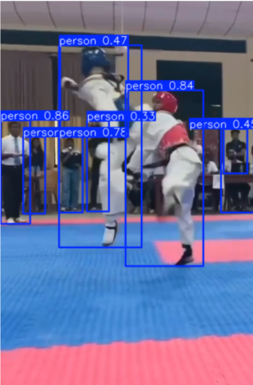

Output for the test images from custom model

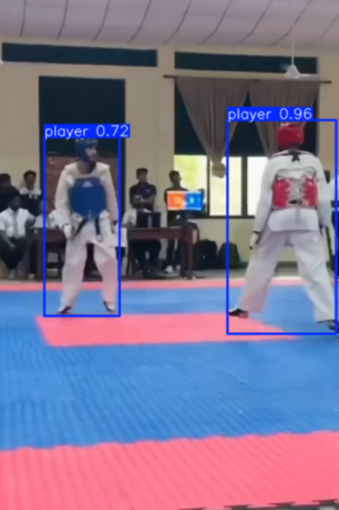
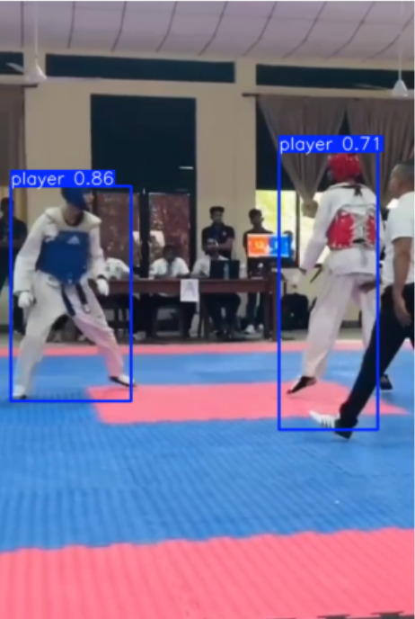

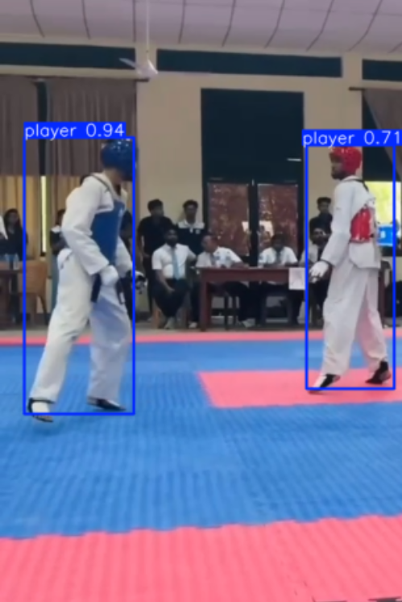
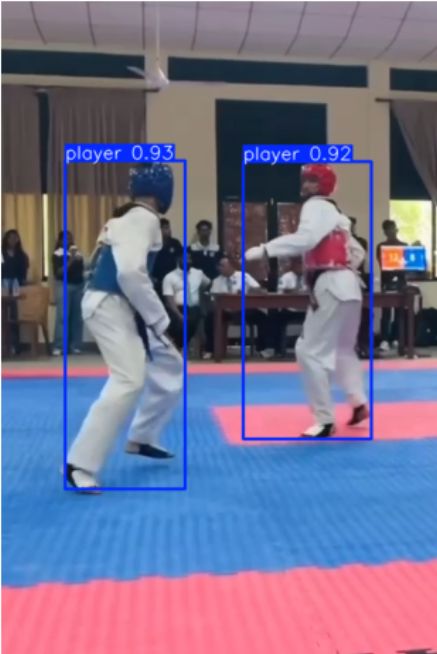
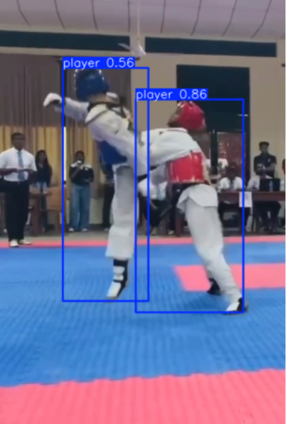
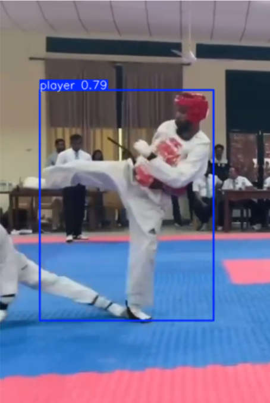
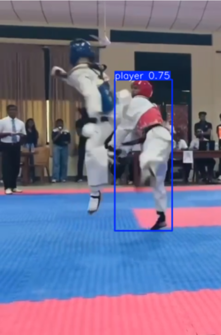

Key point Identification

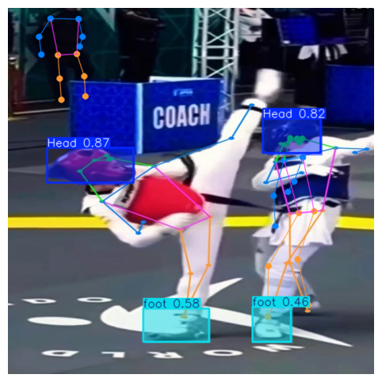
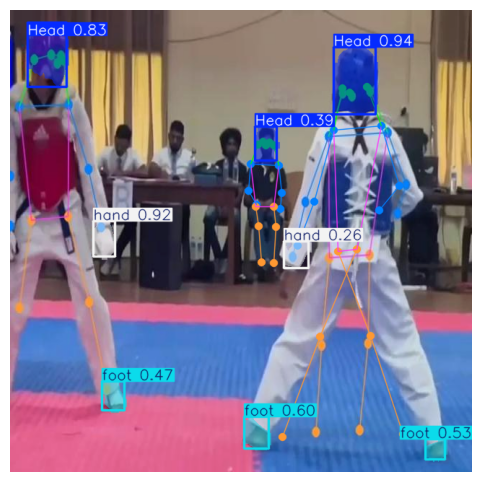
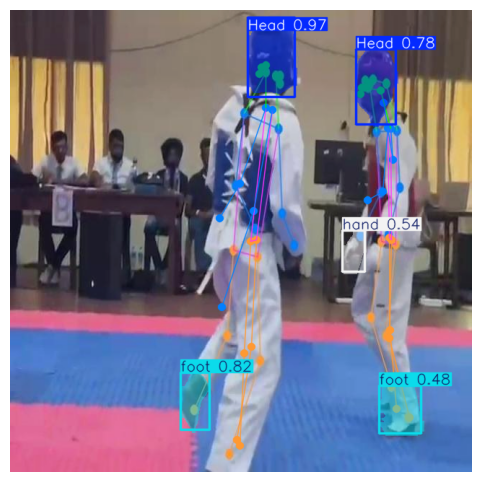

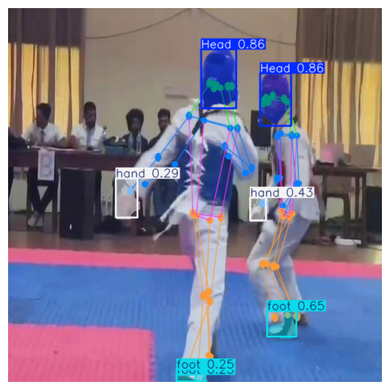
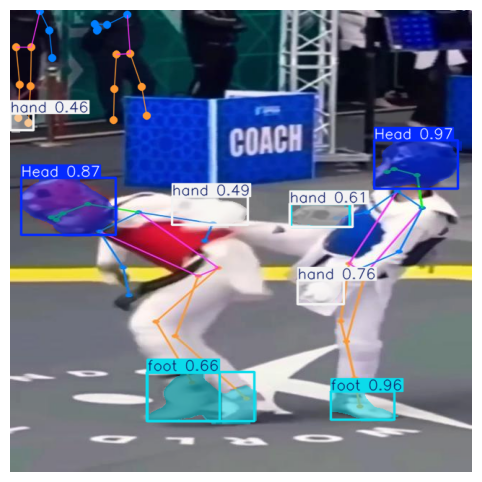
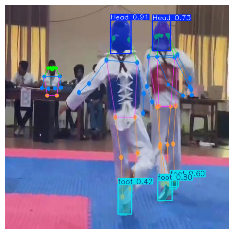
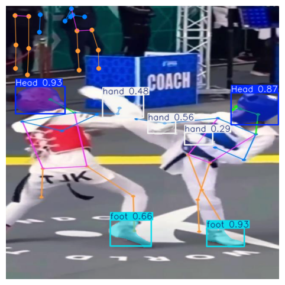